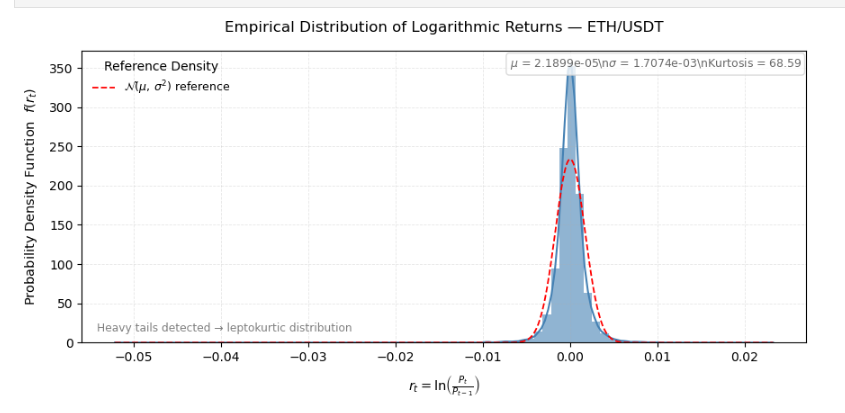

🚧 Project under construction — stay tuned 🚧

[▓▓▓▓▓▓▓▓▓▓▓▓▓▓▓▓▓▓▓▓▓▓░░░░░░░░] 68%

  <i>Distributions of logarithmic returns and comparative diagnostic visualization. 
  Heavy tails, volatility clustering, and the peculiar geometry of crypto noise.</i>

---

### Modeling 5-minute Ethereum volatility with GARCH-family models

---

### 🧩 Project Overview

This repository analyzes short-term volatility dynamics of the **ETH/USDT** pair using 5-minute candles over a 3-month period.  
The purpose is to **train and evaluate GARCH and EGARCH models** on this high-frequency dataset — illustrating how conditional variance models behave in the chaos of crypto markets.

Volatility isn’t noise — it’s the engine of risk, pricing, and market structure.  
And in crypto, it’s not a Gaussian whisper; it’s a stochastic scream.

---

### 📊 Methodology and Scope

#### 1. Data and Modeling Logic

The dataset is intentionally small — **two months for training, one month for out-of-sample testing**.  
That’s nowhere near enough for production-grade modeling, but perfect for demonstration.  
In real deployment, far longer samples are required for **parameter stability**, **robust variance estimation**, and to avoid the statistical equivalent of wishful thinking.

#### 2. Core Principles

Before touching a volatility model, you need to understand the physics behind it.  
We **never** model raw prices — only **log returns**. Prices are non-stationary by definition; working on them is statistical profanity.  
Volatility models like GARCH assume stationarity, finite variance, and predictable conditional heteroskedasticity — ignore that and your model will implode faster than an overleveraged token.

#### 3. Models

- **GARCH(1,1)** — baseline for conditional variance.
- **EGARCH(1,1)** — captures asymmetry and leverage effects, because markets don’t react linearly to pain.

Evaluation is done via **out-of-sample forecasts**, checking whether variance predictions generalize beyond the training window.

---

### ⚙️ For the Mathematically Literate Only

This repository is **not** a step-by-step tutorial for beginners.  
You’re expected to have a working understanding of:  
Hilbert spaces, differential calculus, stochastic processes, conditional heteroskedasticity, leptokurtosis, stationarity, and regime switching.  
You should also be comfortable with:  
stochastic differential equations (SDEs), Ito calculus, mean-reverting processes, volatility clustering, Markov chains, ergodicity, and the subtle horrors of model misspecification.

If those words sound like passwords rather than tools — come back later.

---

> “Volatility isn’t chaos — it’s structure pretending to be random.”
